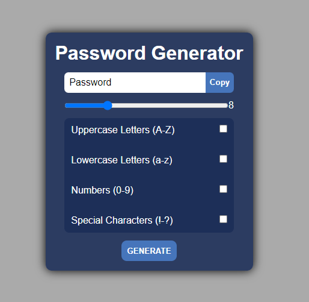
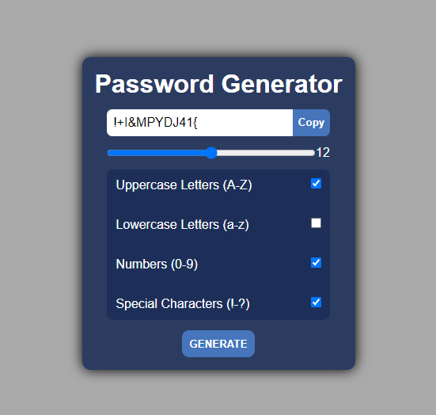

 

  

  <h3 align="center">Password Generator</h3>

  

    Create a random password with this generator.
  

  
Table of Contents

  <ol>
    <li>
      <a href="#about-the-project">About The Project</a>
    </li>
    <li>
      <a href="#how-does-it-work">How does it work</a>
    </li>
    <li>
      <a href="#screenshots">Screenshots</a>
    </li>
  </ol>

## About The Project
I got the ideia of creating this project to practice vanilla JavaScript, HTML and CSS. The applicattion has the purpose of creating random and strong passwords that can be used on different websites. Don't worry, the generated password is only visible to the user.
It´s a project with the intuition of learning!

Benefits of this app:
* Creates random and strong passwords;
* Only the user can see the password ☺️;

## How does it work
<ol>
  <li>
    The user has the possibilitie of choosing what type of characters the password may contain. 
    Obs: At least one Checkbox has to be checked. Otherwise no password will be generated;
    <ol>
      <li>
        Uppercase Letters.
      </li>
      <li>
        Lowercase Letters.
      </li>
      <li>
        Numbers.
      </li>
      <li>
        Special Characters.
      </li>
    </ol>
  </li>
   
  <li>
    The user can also choose the length of the password.
    The minimum value is 4 characters. The maximum value is 20 characters.
    By default, the password's length is 8 characters.
  </li>
   
  <li>
     After choosing all the properties above and clicking the "GENERATE" button a random password will be displayed as the result. When generated, it's possible to copy the password to the clipboard by clicking the COPY button.
  </li>
   
</ol>
And then... it's all done. Just paste the password where you want!

Feel welcome to contact me!

## Screenshots
 
 
